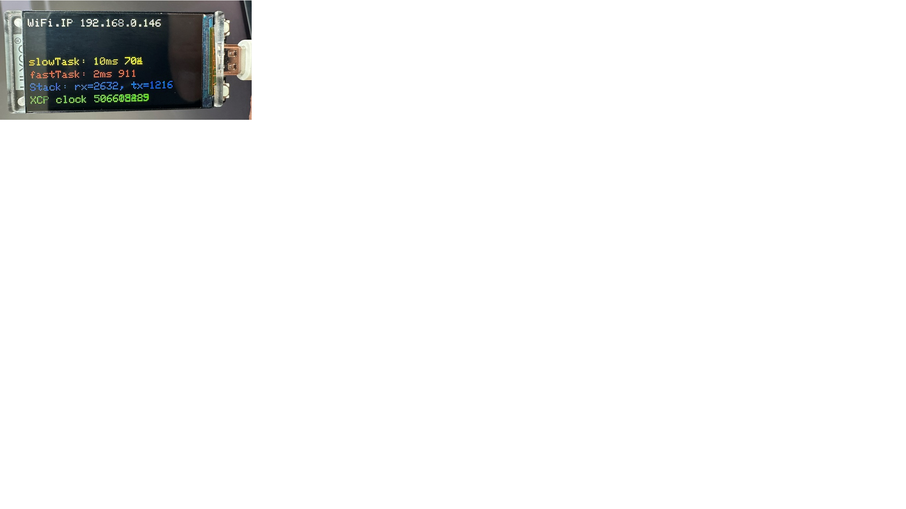

# ESP32 FreeRTOS Demo

This example runs XCPlite on an ESP32 board using the Arduino framework and the ESP32 FreeRTOS/lwIP runtime.  
Its A2L file is completely generated from ELF with the xcpclient tool, no manual editing required.


## Preconditions

You need:

- vscode with PlatformIO installed, or PlatformIO Core available as `pio`.
- An ESP32-S3 board compatible with `lilygo-t-display-s3`, or an adapted `platformio.ini`.
- A 2.4 GHz WLAN. ESP32 does not connect to 5 GHz-only networks.
- The ESP32 and the PC running the XCP client must be on the same network.
- `xcpclient` for testing and offline A2L generation.
- A CANape full licence or demo version.




## Demo Details

The demo currently:

- Connects the ESP32 to a 2.4 GHz WLAN.
- Scans for the configured SSID and selects the strongest matching BSSID.
- Prints Wi-Fi RSSI, channel, encryption mode, BSSID, disconnect reason, and assigned IP address.
- Starts the XCPlite server after Wi-Fi is connected.
- Binds the XCP UDP server to `0.0.0.0:5555`.
- Creates 2 demo tasks with calibration parameters and measurement events and variables.
- OPTION_DISPLAY: Displays some status on the T-Display-S3 LCD using LovyanGFX.
- OPTION_IO: Toggles IO pins
- OPTION_ANALOG: Reads analog voltage measurments from an external ADS1115 4 channel converter connected on I2C


### Display

OPTION_DISPLAY enables the LCD display specific code.


### Scope Pins

OPTION_IO enables digital outputs to overce the demo tasks.  

Both demo tasks are pinned to the same ESP32 core so the scheduler interaction is visible in XCP measurements and on a scope:

- `fastTask`: GPIO2 / IO2, default period 1 ms
- `slowTask`: GPIO1 / IO1, default period 2 ms

Connect both probe grounds to board GND. The pins are driven high while the task is running.


### AD Converter

OPTION_ANALOG enables analog inputs for demonstration of some real world physical measurement values.

The ESP32-specific code uses an external ADS1115 at its default I2C address
`0x48`. Connect it to the LilyGo T-Display-S3 as follows:

| ADS1115 | LilyGo T-Display-S3 |
|---------|---------------------|
| VDD     | 3.3 V               |
| GND     | GND                 |
| SDA     | GPIO18 / P1         |
| SCL     | GPIO17 / P1         |
| ADDR    | GND                 |

ADS1115 input AIN1 reads a pressure sensor voltage. Four XCP parameters define
the voltage-to-pressure calibration:

- `(sensor_voltage_point1, pressure_point1)` in V and bar
- `(sensor_voltage_point2, pressure_point2)` in V and bar

`pressure_sensor_voltage` exposes the raw AIN1 measurement in V, while
`channel1` contains the calibrated pressure in bar. Values between or outside
the calibration points are linearly interpolated or extrapolated. The defaults
map 0 V to 0 bar and 1 V to 1 bar. If both sensor-voltage points are equal,
`channel1` is set to `NaN` because the pressure calibration is invalid.
The display shows the raw voltage as `ADS1115: x.xxx V`, or
`ADS1115: not found` when converter initialization fails.

The converter uses gain 1 (a +/-4.096 V ADC range) and 860 samples/s so a
conversion fits the default 2 ms slow-task period. Regardless of the configured
ADC range, never drive an ADS1115 input below GND or above its supply voltage.

If the ADS1115 is not detected during startup, the demo logs the condition and
continues to generate the original sine signal. Disable `OPTION_ANALOG` in
`platformio.ini` to build without ADS1115 support.


## Quick Path

1. Configure Wi-Fi credentials in `src/wlan.h` or via PlatformIO build flags.

2. Build and upload the firmware:
   ```bash
   pio run --target upload
   ```
   
3. Open the serial monitor and note the ESP32 IP address:
   ```bash
   pio device monitor
   ```

4. The local machine must have xcpclient installed:
   ```bash
     cd XCPlite
     ./build.sh rust_tools cargo_install
   ```

5. Generate the A2L file from the firmware ELF and check the log for warnings:
   ```bash
   xcpclient --offline --udp --dest-addr <esp32-ip-address> --elf .pio/build/lilygo-t-display-s3/firmware.elf --a2l CANape/freertos_demo.a2l --default-event=fastTask --elf-unit-filter xcp_demo --log-level=3 --verbose=1
   ```

6. Connect with CANape using the project in `CANape`, or run a basic xcpclient measurement test:
   ```bash
   xcpclient --udp --dest-addr <esp32-ip-address> --a2l CANape/freertos_demo.a2l --mea slowTask.counter
   ```


## Wi-Fi Credentials

The sketch includes `wlan.h` when `WIFI_SSID` or `WIFI_PASSWORD` are not provided by build flags:

```cpp
#if !defined(WIFI_SSID) || !defined(WIFI_PASSWORD)
#include "wlan.h"
#endif
```

Example:
```cpp
#pragma once

#define WIFI_SSID "your-ssid"
#define WIFI_PASSWORD "your-password"
```

`wlan.h` is ignored by this example's `.gitignore`.

Alternatively, pass credentials with PlatformIO build flags:

```ini
build_flags =
    -DWIFI_SSID=\"your-ssid\"
    -DWIFI_PASSWORD=\"your-password\"
```


## Configure, Build and Run

### Configure

The XCPlite repository `inc/` and `src/` folders need to be in the include path.

XCP server connection options are set in the shared `../xcp_demo.c` module:

- XCP on Ethernet over UDP
- XCP server port: `5555`

TCP is currently not supported.  


### Build

XCPlite source files are built directly from the XCPlite repository `src/` folder.  
Building a library could be added later.  

If `pio` is in your shell path:

```bash
pio run
```

`src/xcp_demo.cpp` includes the shared `../xcp_demo.c` module so that it is
compiled as C++. PlatformIO does not currently track that external included
file reliably. After changing `../xcp_demo.c`, use a clean build:

```bash
pio run --target clean
pio run
```


### Upload

The current serial port is configured in `platformio.ini`:

Example:
```ini
upload_port = /dev/cu.usbmodem101
monitor_port = /dev/cu.usbmodem101
```

Adjust it if your board enumerates differently:
```bash
pio device list
```

Upload:
```bash
pio run --target upload
```

If upload has trouble entering the bootloader, hold BOOT while upload starts and release it when PlatformIO prints `Connecting...`.


### Serial Monitor

```bash
pio device monitor
```

You should see log messages from the XCP server.  
The log level may be set with XCP_LOG_LEVEL.


### Network Test

First confirm that the board confirms receiving an IP address in the serial log.

Then try:
```bash
ping <esp32-ip-address>
```

The XCP server listens on UDP port `5555`.


### XCP test

Execute a basic XCP connection test:

```bash
xcpclient --udp --dest-addr 192.168.0.146
```

The upload A2L file error message can be ignored, as the FreeRTOS implementation does not support on-target A2L generation and A2L upload.

Execute a measurement

```bash

# with ELF file
xcpclient --udp --dest-addr 192.168.8.127 --elf .pio/build/lilygo-t-display-s3/firmware.elf --elf-unit-filter xcp_demo --mea slowTask.counter 

# or with an A2L file
xcpclient --udp --dest-addr 192.168.8.127 --a2l CANape/freertos_demo.a2l --log-level=2 --mea slowTask.counter 

```


## Offline A2L generation

Locate the ELF file and generate the A2L file with xcpclient (see chapter xcpclient below).

Recommended command from this example directory:

```bash
xcpclient --offline --udp --dest-addr 192.168.8.127 --elf .pio/build/lilygo-t-display-s3/firmware.elf --a2l CANape/freertos_demo.a2l --elf-unit-filter xcp_demo 
```

`--elf-unit-filter xcp_demo` keeps the generated A2L focused on this demo application instead of adding symbols from all linked code.  
Supplying `--offline --udp --dest-addr <esp32-ip-address>` writes the target UDP address into the A2L file; otherwise it defaults to localhost.  

Expected static information includes:

- the `foo`, `fastTask` and `slowTask` events;
- the `parameters` calibration segment and its structure members;
- global, static-global, local-static, and supported stack measurements;
- the EPK software version string;
- comments and other annotations from the `xcp_meta` section.

Check the log for warnings.  
Make sure the sections `xcp_evts`, `xcp_cals`, `xcp_meta` and `xcp_epk` are keept, otherwise check your linker script (see below).  


## XCPlite Configuration and Linker Sections

This firmware uses XCPlite's `rtos` configuration through the PlatformIO build flags:

```ini
-DXCPLITE_CONFIGURATION=rtos
-DXCPLIB_CFG_OVERRIDE=\"xcplib_rtos_cfg.h\"
```

Offline A2L generation needs the XCPlite metadata emitted into `xcp_cals`,
`xcp_evts`, `xcp_epk`, and `xcp_meta`. The `xcp_meta` contains annotations
created by `XCP_COMMENT`, `XCP_UNIT`, `XCP_LIMITS`, and `XCP_READ_WRITE`. The
shared demo has some examples.


The descriptors are read during XCPlite initialization and should remain in cached, memory-mapped flash rather than permanently consuming internal RAM.

`extra_linker_script.py` generates a build-local copy of ESP-IDF's `sections.ld`.
It collects `xcp_cals` and `xcp_evts` at the beginning of the existing
`.flash.rodata` output section and defines `__start_xcp_cals`, `__stop_xcp_cals`, `__start_xcp_evts`, and `__stop_xcp_evts`. It places `xcp_epk` and `xcp_meta` immediately after `.flash.rodata` as individually named
output sections because `xcpclient` locates them by ELF section name. 
All four remain in the same mapped flash region, and the installed PlatformIO framework
files are not modified. 

Notes: 

`extra_linker_script.py` retains `xcp_evts` and `xcp_cals` inside `.flash.rodata`, so the final ELF does not contain an output sections literally named `xcp_evts` and `xcp_cals`.  
Newer versions of `xcpclient` can handle this, xcpclient looks for the section boundary variables, for `__start_xcp_xxxx` and `__stop_xcp_xxxx`, when the section itself is not found.

ESP-IDF also requires the sections `.flash.appdesc` and `.flash.rodata` to be adjacent in the
final image. If the XCPlite input sections are left as linker orphans, they can
be placed between those two output sections and ESP-IDF refuses to create `firmware.bin`.
See the comments in `extra_linker_script.py`.


### Offline A2L generation without linker sections

The recommended method is enabling the linker section based registration of events, calibration segments, epk and metadata.
See the comment in the header of `xcp_demo.c` for details.


## XCPlite Source Selection

The PlatformIO build uses `extra_script.py` to compile only the XCPlite source files needed for 32-bit embedded targets:

```text
src/xcpappl.c
src/xcplite.c
src/xcpethserver.c
src/xcpethtl.c
src/queue32m.c
src/cal.c
src/platform.c
src/sockets.c
```

The XCPlite source files remain in the repository `src/` folder and are not copied into this example. 
The platform-specific `src/xcp_demo.cpp` wrapper includes the shared FreeRTOS demo implementation from `../xcp_demo.c`, which can be compiled as C or C++.


## Adapting to other ESP32 Hardware in PlatformIO

Change the PlatformIO board in `platformio.ini`:

```ini
board = esp32dev
```

or choose the exact board ID from PlatformIO.

For a board without the LilyGo display:

- Remove `lovyan03/LovyanGFX` from `lib_deps`.
- Leave `OPTION_DISPLAY` undefined.


